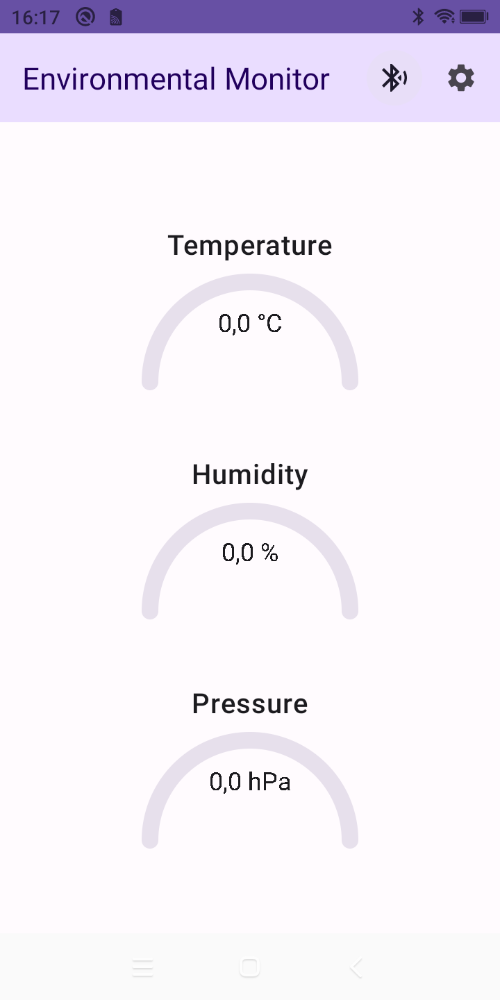
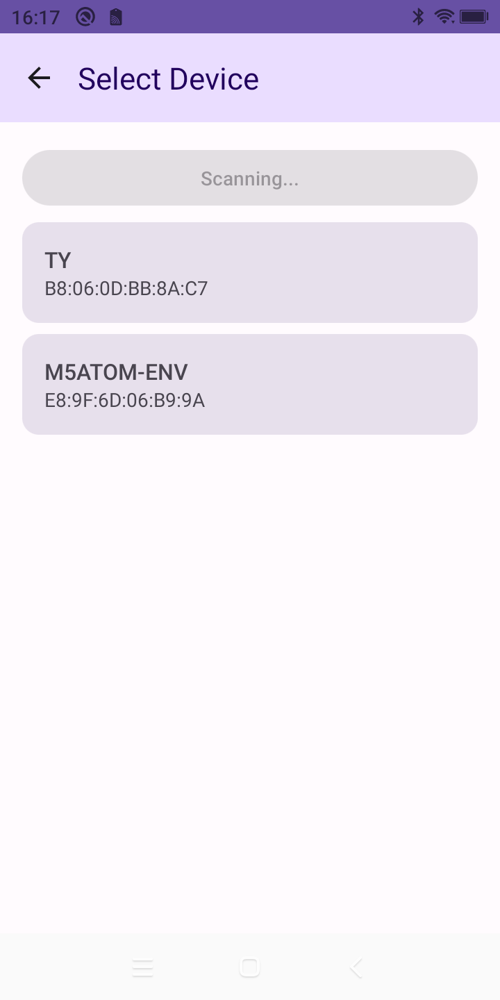
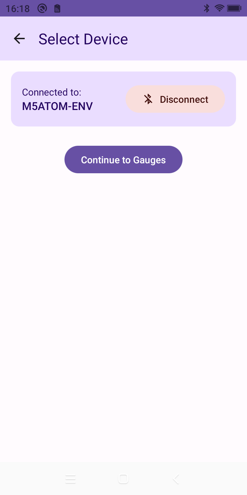

# Environmental Monitor - Jetpack Compose Version

Modern Android application for environmental monitoring using Jetpack Compose and the latest Android development practices.

## Screenshots

<div align="center">
  
  
  
</div>

## Features

- Real-time environmental data visualization using custom gauges
    - Temperature (°C)
    - Humidity (%)
    - Pressure (hPa)
- Bluetooth LE device management
    - Automatic device discovery
    - Easy device selection
    - Persistent connections
- Modern Material 3 design
    - Dynamic color support
    - Dark theme
    - Responsive layouts
- Sensor data monitoring with real-time updates

## Technology Stack

- **UI Framework**: Jetpack Compose with Material 3
- **Architecture**: MVVM + Clean Architecture
- **Dependency Injection**: Hilt
- **Navigation**: Jetpack Navigation Compose
- **Async Operations**: Kotlin Coroutines & Flow
- **Language**: Kotlin
- **Minimum SDK**: 24 (Android 7.0)
- **Target SDK**: 34 (Android 14)

## Project Structure

```
com.envmonitor.app/
├── data/
│   ├── repository/  # Data repositories
│   └── model/       # Data models
├── domain/
│   └── usecase/     # Business logic
├── ui/
│   ├── theme/       # App theme and styling
│   ├── components/  # Reusable UI components
│   └── screens/     # App screens
└── di/              # Dependency injection
```

## Setup Requirements

- Android Studio Hedgehog or newer
- JDK 17
- Android SDK 34
- A device with Bluetooth LE support

## Building the Project

1. Clone the repository
2. Open the project in Android Studio
3. Sync project with Gradle files
4. Run the app on an emulator or physical device

## Permissions

The app requires the following permissions:

- `BLUETOOTH` and `BLUETOOTH_ADMIN` for device scanning
- `BLUETOOTH_CONNECT` for connecting to devices (Android 12+)
- `BLUETOOTH_SCAN` for scanning devices (Android 12+)

## Development

The project follows modern Android development best practices:
- Material 3 design guidelines
- Reactive UI with Compose
- State management with StateFlow
- Dependency injection with Hilt
- Custom UI components using Canvas
- Clean Architecture principles

## Contributing

1. Fork the repository
2. Create your feature branch
3. Commit your changes
4. Push to the branch
5. Create a Pull Request

## License

This project is licensed under the MIT License - see the LICENSE file for details
